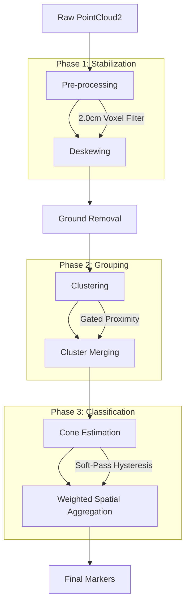

# Pipeline Architecture and High-Level Workflow

This document provides a high-level overview of the LiDAR perception pipeline, detailing the data flow from raw sensor input to semantic cone detections.

## System Overview

The pipeline is designed as a sequential execution model, optimized for deterministic latency and real-time control (20Hz target).

### Stage Descriptions

1.  **Pre-processing**: Rapid spatial truncation and early voxelization. The **2.0cm voxel** size is chosen to leverage the high resolution of the 40-channel LiDAR (0.33° vertical) while reducing total points.
2.  **Deskewing**: High-frequency IMU integration (NLERP) to compensate for sensor motion during the sweep.
3.  **Ground Removal**: Binary segmentation of the environment into traversable surface and obstacle candidates (using Patchwork++ or Slope Analysis).
4.  **Clustering**: Spatial grouping of obstacle points into candidate clusters.
5.  **Cluster Merging**: Geometric unification of fragmented clusters. Candidates within **0.25m** are merged to form a single volumetric object, improving detection stability for sparse returns.
6.  **Cone Estimation**: Bayesian-like geometric validation using PCA-derived features (linearity, planarity, scattering) and dynamic thresholds with soft-pass logic.
7.  **Weighted Spatial Aggregation**: Instead of standard NMS, positions are averaged across nearby candidates to ensure smooth, fluid motion in the output.
8.  **Final Markers**: Asynchronous publication of visualization markers and semantic point clouds for fusion.
