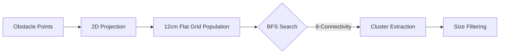
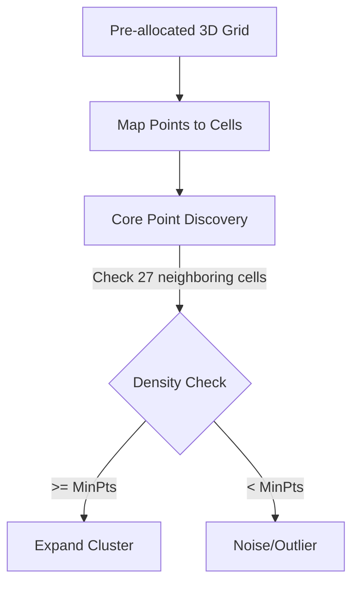
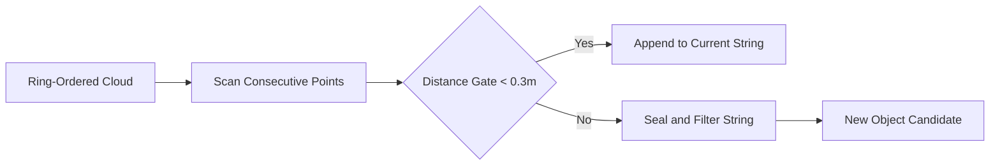

# Spatial Clustering and Object Aggregation Strategies

Spatial clustering partitions the obstacle cloud $\mathcal{P}_o$ into $K$ disjoint candidate objects $\{\mathcal{C}_1, \dots, \mathcal{C}_K\}$.

## Clustering Algorithm Deep-Dive

### 1. Grid Clusterer (BFS-Connected Components)
Optimized for 2D flat track scenarios. Points are projected onto a 2D grid where neighboring cells are grouped using Breadth-First Search (BFS).

- **Complexity**: Strictly $O(N)$ due to the pre-allocated flat grid.
- **Limitation**: Ignores Z-axis separation.

### 2. Hash-Grid Optimized DBSCAN
Combines density-based robustness with deterministic $O(1)$ neighbor lookup.

- **Performance**: Eliminates KD-Tree rebuild overhead, ensuring P99 stability.

### 3. String Clusterer (Linear Scan)
Utilizes the sequential nature of LiDAR sweeps to group points in a single pass.

- **Prerequisite**: Requires driver-level ring sorting.

## Summary of Optimization Changes
- **Grid Resolution**: Lowered from **20cm to 12cm** to minimize spatial aliasing for standard cones (22.8cm width).
- **Min Cluster Size**: Relaxed to **2 points** to improve detection at extreme ranges where point density is minimal.
