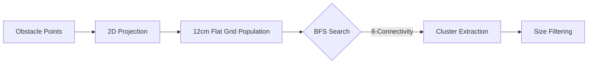
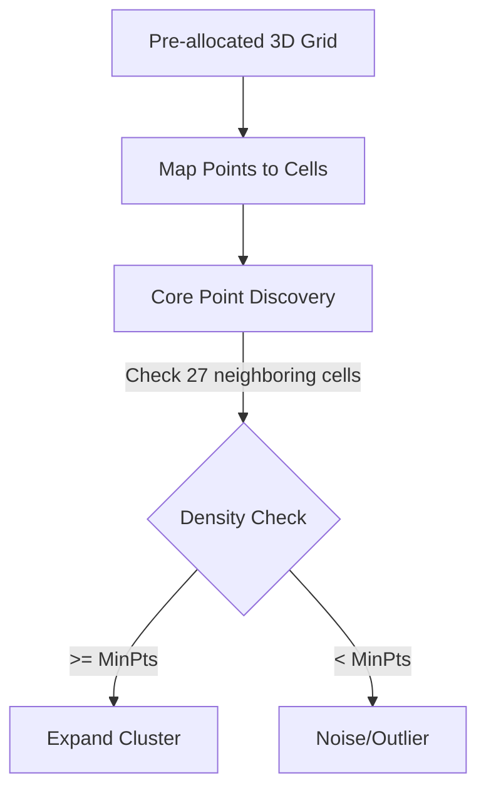

# Spatial Clustering and Object Aggregation Strategies

Spatial clustering partitions the obstacle cloud $\mathcal{P}_o$ into $K$ disjoint candidate objects $\{\mathcal{C}_1, \dots, \mathcal{C}_K\}$.

## Strategy Comparison Matrix

The following table provides a high-level comparison of the available clustering strategies:

| Algorithm | Complexity | Dimensionality | Best Use Case | Detail Page |
| :--- | :--- | :--- | :--- | :--- |
| **Grid BFS** | $O(N)$ | 2D | Flat track racing, minimal Z-overlap. | [Read more](./clustering_grid.md) |
| **DBSCAN** | $\approx O(N)$ | 3D | General purpose, noise-tolerant. | [Read more](./clustering_dbscan.md) |
| **HDBSCAN** | $O(N^2)$ | 3D | Best quality, lidar-aware stability. | [Read more](./clustering_hdbscan.md) |
| **Euclidean (KD-Tree)** | $O(N \log N)$ | 3D | High precision, standard PCL wrapper. | [Read more](./clustering_euclidean.md) |
| **Depth (Range-Img)** | $O(N)$ | 3D-Topo | Ultra-low latency, SOTA scale-invariance. | [Read more](./clustering_depth.md) |
| **Voxel CC** | $O(N)$ | 3D | Sparse data, Z-separation needed. | [Read more](./clustering_voxel_cc.md) |

## Clustering Algorithm Summaries

### 1. Grid Clusterer (BFS-Connected Components)
Optimized for 2D flat track scenarios. Points are projected onto a 2D grid where neighboring cells are grouped using Breadth-First Search (BFS).

- **Complexity**: Strictly $O(N)$ due to the pre-allocated flat grid.
- **Limitation**: Ignores Z-axis separation.
- **Detailed Docs**: [Grid Clusterer Technical Deep-Dive](./clustering_grid.md)

### 2. Hash-Grid Optimized DBSCAN
Combines density-based robustness with deterministic $O(1)$ neighbor lookup.

- **Performance**: Eliminates KD-Tree rebuild overhead, ensuring P99 stability.
- **Detailed Docs**: [DBSCAN Technical Deep-Dive](./clustering_dbscan.md)

### 3. HDBSCAN (Hierarchical Clustering)
A SOTA algorithm that extracts clusters based on their persistence across multiple density scales. It is exceptionally robust to noise and varying point densities at range.
- **Detailed Docs**: [HDBSCAN Technical Deep-Dive](./clustering_hdbscan.md)

### 4. Depth-Clustering (Range-Image BFS)
Evolves the linear scan approach into a 2D topological search. By projecting points into a range image, it captures complete 3D volumes without needing an external merging stage.
- **Detailed Docs**: [Depth-Clustering Technical Deep-Dive](./clustering_depth.md)

## Summary of Optimization Changes
- **Grid Resolution**: Lowered from **20cm to 12cm** to minimize spatial aliasing for standard cones (22.8cm width).
- **Min Cluster Size**: Relaxed to **2 points** to improve detection at extreme ranges where point density is minimal.
