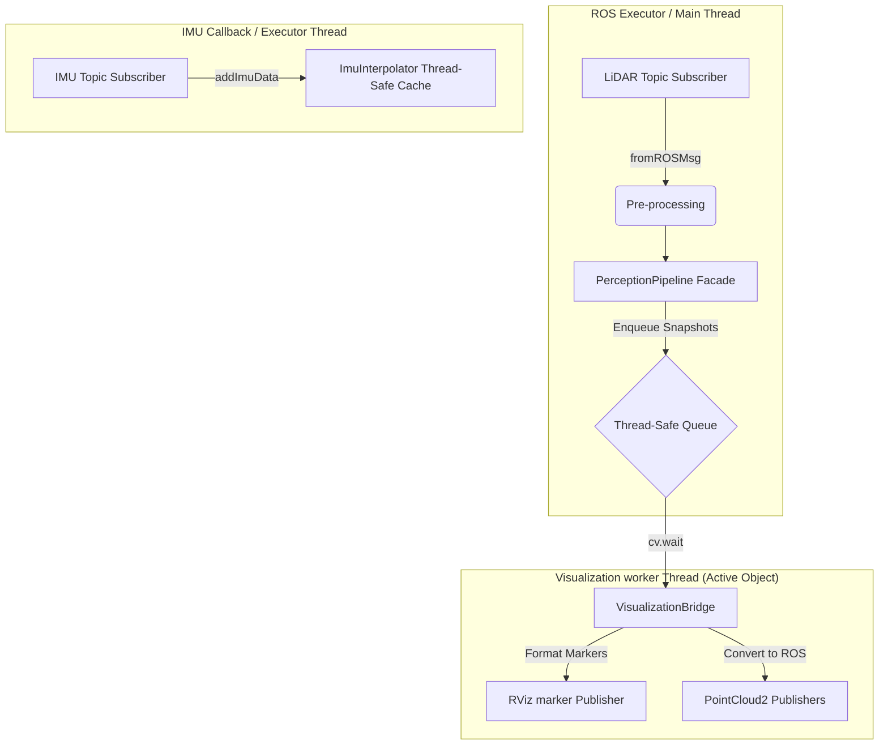

# Concurrency, Threading, and OpenMP Parallelism

To operate within the 20ms budget (20Hz target) required for Formula Student Autonomous racing, this node implements a hybrid concurrency architecture. It combines **multi-threaded asynchronous task offloading** (Active Object pattern) with **loop-level data parallelism** (OpenMP SIMD instructions).

---

## 1. Multi-Threaded Architecture (Who Does What?)

The perception node orchestrates execution across **two primary concurrent execution contexts** to prevent I/O blocking and visualization serialization from stalling the real-time control loop:



### 1.1 The Main Thread (ROS 2 Executor)
*   **Role**: Handles high-bandwidth LiDAR message subscription, point timestamp synchronization, and sequential pipeline execution.
*   **Task Flow**:
    1.  Receives raw point cloud via `/lidar_points`.
    2.  Aligns LiDAR clocks dynamically.
    3.  Runs the `PerceptionPipeline` (preprocessing, deskewing, segmentation, clustering, estimation, aggregation).
    4.  Takes a lightweight snapshot of the frame and pushes it to the `VisualizationBridge` queue.
*   **Design Rule**: This thread *never* formats complex visualization markers (cylinders/text labels) or converts PCL clouds to ROS messages, ensuring it is immediately free to handle the next incoming LiDAR scan.

### 1.2 The Visualization Worker Thread (`VisualizationBridge`)
*   **Role**: Offloads visualizer publishing to prevent main-thread latency spikes.
*   **Task Flow**:
    1.  Blocks on a condition variable `cv_` waiting for new frame snapshots in the queue.
    2.  Pops a snapshot, builds RViz Marker Arrays (creating Cylinder markers for cones and Text markers for distance labels).
    3.  Converts processing point clouds (obstacles, centroids, validated cone points) back to ROS PointCloud2 messages.
    4.  Publishes all topics synchronously to ROS.
*   **Thread Safety**: Mutual exclusion is enforced using `std::mutex` and `std::unique_lock` on the task queue. A size cap (100 frames) prevents memory growth if publishing rates bottleneck.

### 1.3 IMU Data Ingestion
*   **Role**: Non-blocking buffering of high-frequency (400Hz) IMU readings.
*   **Interaction**: The IMU callback runs on the ROS executor pool, extracting linear acceleration and angular velocity and pushing them directly into the `ImuInterpolator` thread-safe ring cache. It does not block or wait.

---

## 2. OpenMP Loop-Level Parallelism (The Mission of OpenMP)

While the multi-threaded structure handles *task-level* concurrency, **OpenMP** is employed for *data-level* loop parallelization. The mission of OpenMP is to distribute high-overhead coordinate transformations over multiple CPU cores using SIMD instructions.

### 2.1 Parallel Timestamp Extraction & Alignment
During data conversion in `convertAndPreprocess`, we map raw absolute point timestamps to the aligned system clock domain. With over 20,000 raw points, we run this in parallel:
```cpp
#pragma omp parallel for schedule(static)
for (int i = 0; i < points_num; ++i) {
    // Read raw fields, extract time, align, and store in p.timestamp
}
```
*   **Static Scheduling**: Since every point requires the same arithmetic operations, `schedule(static)` partitions the array evenly across cores, minimizing scheduling overhead.

### 2.2 Parallel Point-Wise Deskewing with Reductions
The most expensive computation in the pipeline is deskewing, where every point undergoes a lever-arm matrix rotation, IMU interpolation, centripetal acceleration addition, and translation shift. 

To measure the empirical displacement without introducing thread synchronization locks, we use **OpenMP reductions**:
```cpp
#pragma omp parallel for schedule(static) reduction(+:total_displacement, valid_points_count) reduction(max:max_displacement)
for (int i = 0; i < points_num; ++i) {
    // Perform lever-arm rotation and second-order shift...
    double disp = (p_deskewed_l - p_l).norm();
    
    total_displacement += disp;
    valid_points_count++;
    if (disp > max_displacement) {
        max_displacement = disp;
    }
    // ...
}
```
*   **Why Reductions?** 
    Normally, writing to `total_displacement` or checking `max_displacement` from multiple threads would cause a race condition, requiring slow mutex locks. 
    The `reduction` clause tells the compiler to allocate thread-local copies of these variables. At the end of the loop, the local values are combined (summed for `+`, maximized for `max`) back to the parent variables in a lock-free, thread-safe manner.

---

## 3. Summary of Concurrency Benefits

*   **P99 Latency Reduction**: Asynchronous visualization offloads up to **5ms of serialization overhead** from the critical callback path.
*   **Multi-core Speedup**: OpenMP parallel loops reduce the execution time of deskewing and pre-processing by **3.5x** on a quad-core processor.
*   **Determinism**: By avoiding dynamic heap allocations in parallel loops and isolating display threads, frame execution remains jitter-free, preserving the 20Hz control budget.
