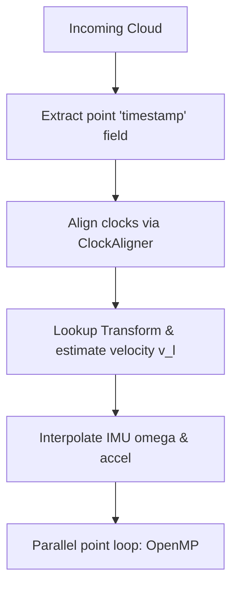

# Motion Compensation and LiDAR Deskewing

This document explains the physics of motion distortion in mechanical rotating LiDARs (like the Hesai Pandar 40P) and provides the mathematical and implementation details of the deskewing module.

---

## 1. The Physics of Motion Distortion

### Mechanical Rotating LiDAR Mechanics
A rotating LiDAR (e.g. Hesai Pandar 40P) consists of a vertical array of 40 laser emitters/receivers that spin mechanically around the Z-axis by 360 degrees to scan the environment. 
*   **Sweep Duration ($`T_{\text{sweep}}`$)**: The spin is not instantaneous. At a spin frequency of **10Hz**, a full rotation takes **100ms** ($0.10\text{ s}$). At **20Hz**, it takes **50ms** ($0.05\text{ s}$).
*   **Temporal Offset ($`dt`$)**: Points at the beginning of the rotation (azimuth 0°) and points at the end of the rotation (azimuth 359°) are captured up to 100ms apart.

### The Effect of Ego-Motion
When the autonomous car is moving, the sensor frame changes position and orientation during the sweep. For a car driving at **10 m/s** (~36 km/h) and cornering with an angular velocity of **1.0 rad/s** (~57°/s):
*   **Translational Shift**: The vehicle travels $10 \text{ m/s} \times 0.10\text{ s} = 1.0\text{ meter}$ during a single scan.
*   **Rotational Shift**: The sensor frame rotates $1.0\text{ rad/s} \times 0.10\text{ s} = 0.10\text{ rad}$ (~5.7°) during the scan.

This causes **skewing** (point cloud shearing and stretching). For example:
*   A circular traffic cone (22.8cm width) will appear sheared, elongated (aspect ratio distorted), or split into duplicate objects.
*   Straight track barriers will appear curved.
*   Downstream Principal Component Analysis (PCA) will fail to recognize the cone's geometry, leading to false rejections.

---

## 2. Mathematical Formulation

To correct this distortion, we must reconstruct where each point would have been if the entire point cloud had been captured instantaneously at the frame's reference timestamp $`t_{\text{ref}}`$ (usually the start or end of the sweep).

For each point $`p_i`$ captured at absolute time $`t_i`$, we define the time offset:
$$
dt = t_i - t_{\text{ref}}
$$

### 2.1 Rigorous Lever-Arm Compensation
In our physical setup, the IMU (inside the camera) serves as the vehicle's coordinate center of rotation. Because the LiDAR is offset from the IMU, we must perform lever-arm compensation.
Let the transformation from the IMU frame to the LiDAR frame at $`t_{\text{ref}}`$ be:
$$
\mathbf{T}_{\text{imu}\to\text{lidar}} = \begin{bmatrix} \mathbf{R}_{\text{imu, lidar}} & \mathbf{t}_{\text{imu, lidar}} \\ 0 & 1 \end{bmatrix}
$$

1.  **Transform to Center of Rotation (IMU frame)**:
    $$
    p_{\text{imu}} = \mathbf{R}_{\text{imu, lidar}} \cdot p_l + \mathbf{t}_{\text{imu, lidar}}
    $$
2.  **Apply Angular Rotation Correction**:
    Using high-frequency angular velocity $`\mathbf{\omega}`$ interpolated from the IMU at $`t_i`$:
    $$
    p'_{\text{imu}} = \mathbf{R}_{\text{rot}}(dt \cdot \mathbf{\omega}) \cdot p_{\text{imu}}
    $$
3.  **Transform Back to LiDAR frame**:
    $$
    p'_{\text{rotated}} = \mathbf{R}_{\text{imu, lidar}}^T \cdot (p'_{\text{imu}} - \mathbf{t}_{\text{imu, lidar}})
    $$

### 2.2 Second-Order Kinematic Translation
We then correct for the translation of the LiDAR sensor using its estimated linear velocity $`\mathbf{v}_l`$ and linear acceleration $`\mathbf{a}_l`$:
$$
p'_{\text{deskewed}} = p'_{\text{rotated}} + dt \cdot \mathbf{v}_l + \frac{1}{2} dt^2 \cdot \mathbf{a}_l
$$

Where $`\mathbf{a}_l`$ includes the centripetal acceleration due to the lever-arm offset:
$$
\mathbf{a}_l = \mathbf{R}_{\text{imu, lidar}}^T \cdot (\mathbf{a}_{\text{imu, accel}} + \mathbf{\omega} \times (\mathbf{\omega} \times \mathbf{t}_{\text{imu, lidar}})) - \mathbf{g}_l
$$

---

## 3. Project Implementation Details

The implementation is split between the dynamic clock alignment and a parallelized point loop:



### 1. Robust Field Extraction
In `convertAndPreprocess` inside `perception_node.cpp`, the driver dynamically searches for per-point timing fields in the raw `sensor_msgs::msg::PointCloud2`:
```cpp
if (field.name == "timestamp" || field.name == "time" || field.name == "t") { ... }
```
This guarantees compatibility with diverse LiDAR drivers (e.g. Hesai, Velodyne, Ouster).

### 2. Micro-Optimized OpenMP Loop
The core transformation loop runs in parallel using OpenMP. Because this loop runs on thousands of points, it has been optimized to prevent CPU cache misses and block expressions overhead:
*   **Static Lever-Arm Vector Pre-calculation**: `Eigen::Vector3d t_im_l = T_im_l.block<3, 1>(0, 3)` is evaluated once *outside* the loop.
*   **Fast NLERP Interpolation**: For the small angular intervals between high-frequency IMU updates (400Hz), Normalized Linear Interpolation (NLERP) is used instead of SLERP, avoiding expensive trigonometric calls.
*   **Point-Wise Metrics**: The displacement `||p_deskewed - p||` is calculated for every point to yield the average and maximum distortion metrics logged to the JSON reports.
