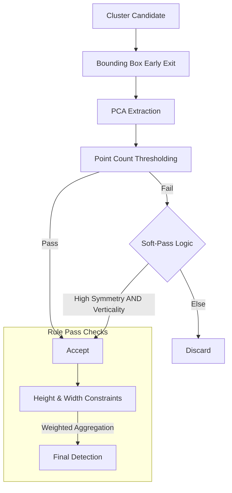

# Geometric Estimation and Cone Classification

Evaluates candidate clusters $\mathcal{C}_k$ using rule-based and statistical shape analysis.

## Classification Logic and Soft-Pass Pipeline

The classification stage follows a hierarchical process designed for stability.

### 1. PCA Feature Extraction
Principal Component Analysis (PCA) is performed using a **Direct Eigen-Solver** on the $3 \times 3$ covariance matrix. 
- **Linearity ($L$):** Rejects posts and poles.
- **Planarity ($P$):** Rejects walls and large surfaces.
- **Scattering ($S$):** Ensures the object has a volumetric, non-flat shape.

### 2. Weighted Spatial Aggregation
To ensure smooth recognition, redundant detections within 0.45m are aggregated using a **Weighted Centroid**. This prevents the reported position from "jumping" between voxel boundaries.

### 3. Hysteresis (Soft-Pass Logic)
To prevent "flickering" of detections, a hysteresis-like mechanism is used:
- If a cluster's point count is within **85%** of the expected threshold but exhibits exceptional verticality ($>0.85$) and symmetry ($<1.5$), it is accepted.
- This allows a high-quality cone to be retained even if one ring or firing is temporarily missed.

## Summary of Parameter Optimizations
- **Expected Points Cap**: Increased to **60** to align with the 2.0cm voxel discretization and 40-channel density.
- **Max Width Ratio (Symmetry)**: Relaxed to **3.5** to accommodate quantization noise.
- **Verticality Threshold**: Increased to **0.65f** to exploit the higher vertical resolution (0.33°) for better axis alignment.
- **Intensity Filtering**: Introduced minimum intensity check to filter non-reflective environmental noise.
