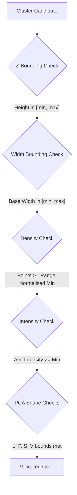

# Geometric Estimation and Cone Classification

The estimation module ([cone_estimator.cpp](file:///Users/m2pro/Lidar_Camera_fusion_ws/src/Lidar_based_Cone_Detection/src/estimation/cone_estimator.cpp)) evaluates candidate clusters $\mathcal{C}_k$ using rule-based dimensions and Principal Component Analysis (PCA) shape features to classify them as verified cones.

---

## 1. Mathematical Principal Component Analysis (PCA)

PCA analyzes the spatial distribution of points in the cluster to construct its 3D bounding geometry.

### 1.1 Covariance Matrix
For a cluster of $N$ points $\{p_1, \dots, p_N\}$, we compute the 3D centroid:
$$\bar{p} = \frac{1}{N} \sum_{i=1}^N p_i$$

The $3 \times 3$ spatial covariance matrix $\mathbf{C}$ is:
$$\mathbf{C} = \frac{1}{N} \sum_{i=1}^N (p_i - \bar{p})(p_i - \bar{p})^T$$

Using a direct Eigen-solver, we compute the eigenvalues sorted in ascending order:
$$\lambda_0 \leq \lambda_1 \leq \lambda_2$$

### 1.2 Geometric Shape Features
The normalized eigenvalues are used to define the cluster's geometric characteristics:
*   **Linearity ($L$)**: Measures the extension along a single 1D axis. High linearity indicates posts, poles, or thin barrels.
    $$L = \frac{\lambda_2 - \lambda_1}{\lambda_2}$$
*   **Planarity ($P$)**: Measures the extension along a 2D plane. High planarity indicates walls, fencing, or asphalt surfaces.
    $$P = \frac{\lambda_1 - \lambda_0}{\lambda_2}$$
*   **Scattering ($S$)**: Measures the omnidirectional 3D volume. Traffic cones exhibit a volumetric shape, requiring a minimum scattering floor.
    $$S = \frac{\lambda_0}{\lambda_2}$$
*   **Verticality ($V$)**: Measures how aligned the cluster's principal axis is with the world vertical axis (gravity direction).

---

## 2. Rule-Based Validation Pipeline

A candidate cluster is validated as a cone if it satisfies the following sequential checks:

### 2.1 Range-Dependent Point Density
Because laser beams diverge, the number of returned points decreases quadratically with distance.
To prevent dropping distant cones, the minimum point count threshold is dynamically scaled with range $r$:
$$\text{Expected Points}(r) = \max\left( \text{min\_pts\_cap}, \text{min\_pts\_at\_10m} \times \left(\frac{10.0}{r}\right)^2 \right)$$

### 2.2 Reflective Intensity Filtering
Regulation Formula Student cones are wrapped in highly reflective retroreflective tape. The average intensity of the cluster's returns must satisfy:
$$\bar{\mathcal{I}} \geq \text{rule\_min\_intensity}$$
This effectively separates cones from dark objects, ground clutter, or non-reflective barriers.

---

## 3. Spatial Aggregation & Duplicate Suppression

After classification, the pipeline runs a spatial grouping step to merge overlapping or redundant detections (e.g. from edge splits).

*   **Logic**: Candidates within a gating distance `tracking_match_dist` (0.45m) are grouped together.
*   **Averaging**: The final reported position $(x, y, z)$ is computed as the arithmetic mean of all matched candidates:
    $$x_{\text{final}} = \frac{1}{M}\sum_{j=1}^M x_j, \quad y_{\text{final}} = \frac{1}{M}\sum_{j=1}^M y_j, \quad z_{\text{final}} = \frac{1}{M}\sum_{j=1}^M z_j$$
    This stabilizes coordinate reporting and prevents the reported centroids from jumping between voxel cell boundaries.
